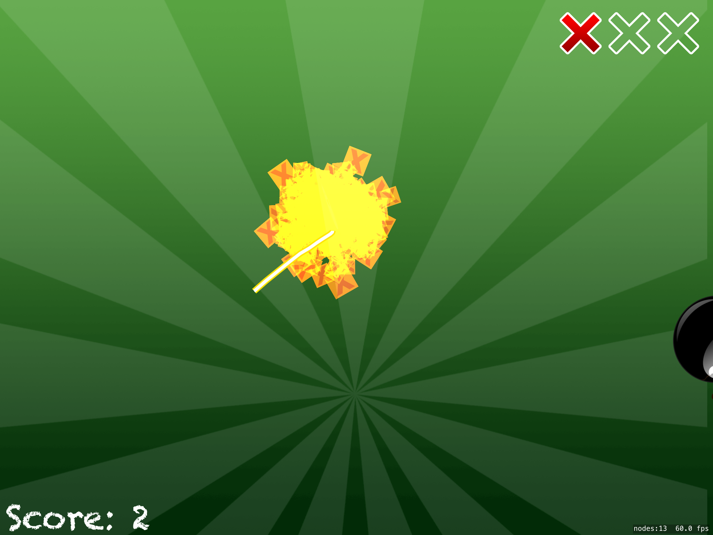
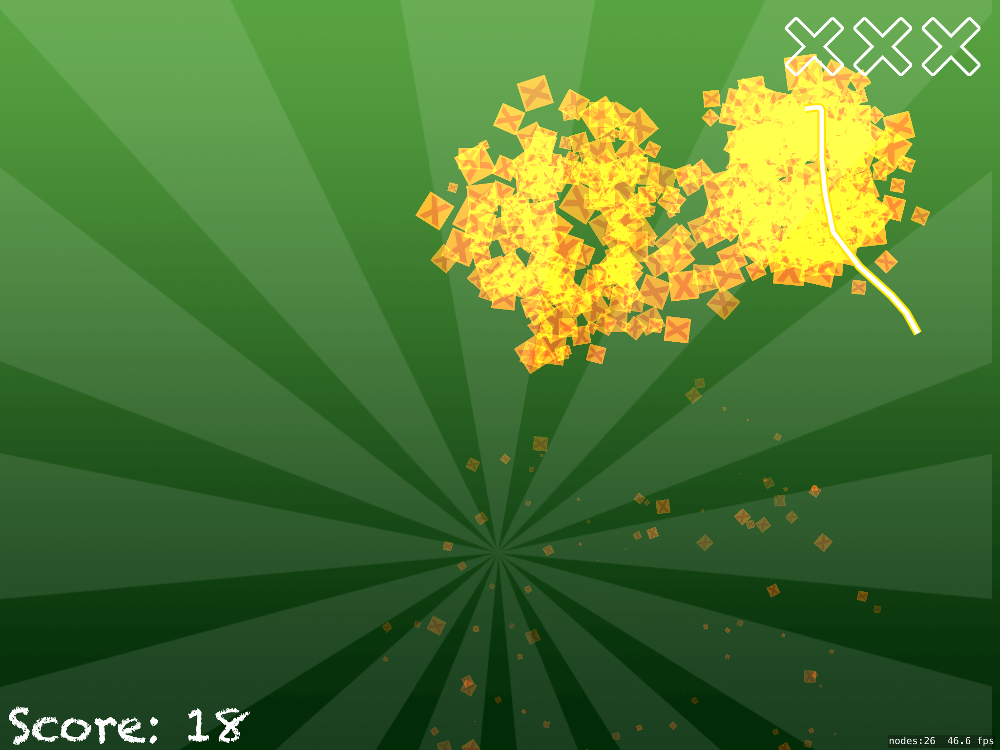
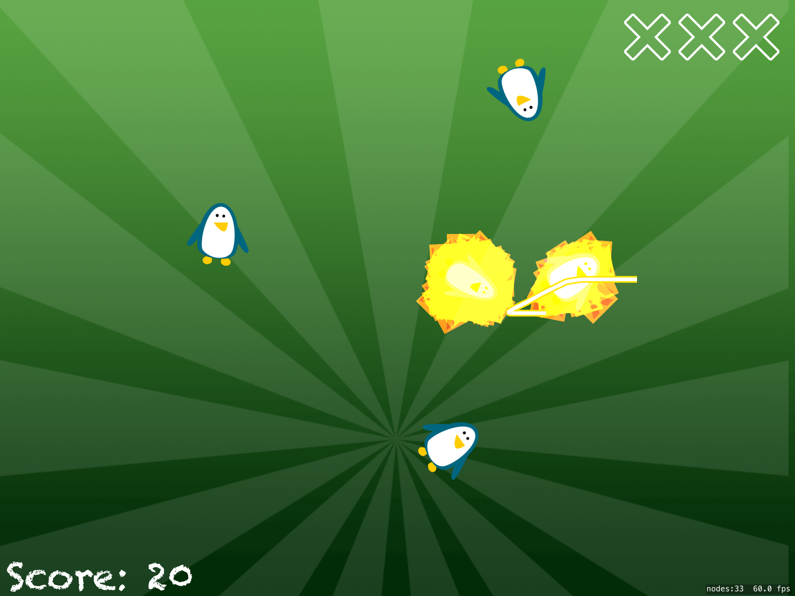
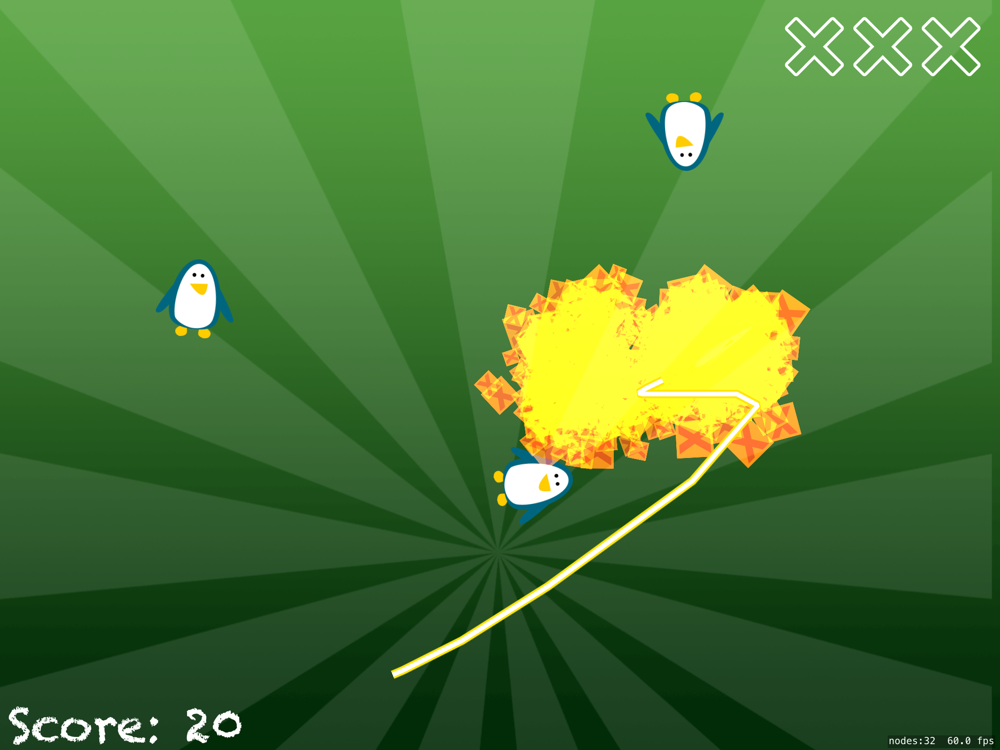

# FroutNinja
The popular game which already exist. 
 ## Project Screen Shots
 
 
## More features soon 
- add new backgrounds and level
- label if wins
- new game button
- new enemies
## Conclusion 
It was an interesting project which helped me to understand how works SpriteKit and how i can play sounds inside game.  

